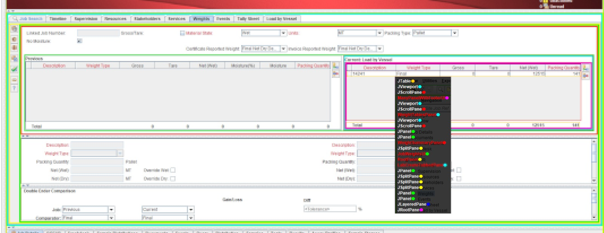

## Features
* Shows a full hierarchy of Swing Components at the given mouse position while Ctrl/Cmd is held down
* Highlights extensions of the Swing Component (i.e. in the developer's own codebase) in red
* Clicking the middle mouse button opens the file for the top non-Swing component in IntelliJ IDEA*

\* Dependent on user's machine supporting `jetbrains://` protocol

## Example Main File For Testing

```java

import javax.swing.*;
import javax.swing.border.EmptyBorder;

import static dev.astles.SwingDevTools.initialise;

public class Debugger {
    
    public static void main(String[] args) {
        JFrame frame = new JFrame();
        frame.setSize(500, 200);
        JPanel panel = new JPanel();
        panel.add(new JCheckBox());
        panel.add(new JTextArea());
        panel.add(new JTextField());
        panel.setSize(200, 200);
        JSplitPane pane = new JSplitPane();
        pane.setSize(100, 100);
        pane.setBorder(new EmptyBorder(10, 10, 10, 10));
        panel.add(pane);
        frame.add(panel);
        frame.setVisible(true);
        initialise(moduleName /* optional */); 
        /*
        moduleName should refer to the module as it appears in IntelliJ's project structure
        if no name is supplied, highlighting functionality will still work but middle button
        click to open IDE will not 
        */
    }

}
```